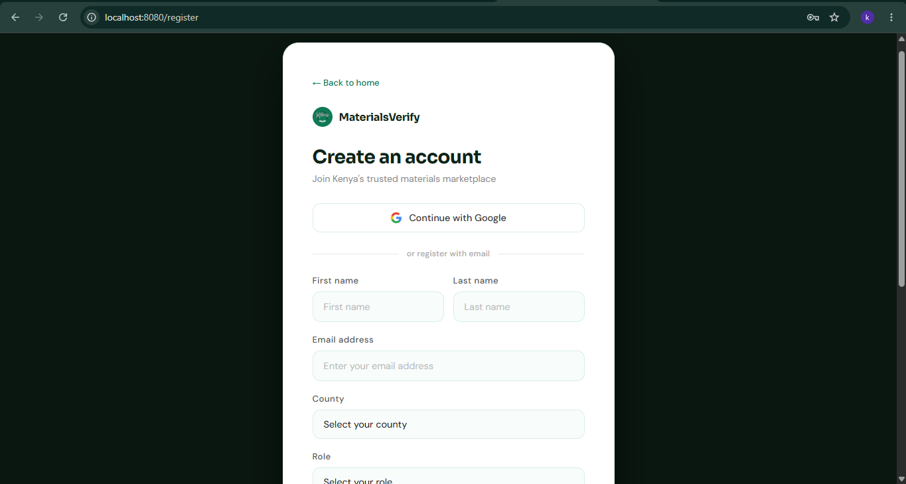
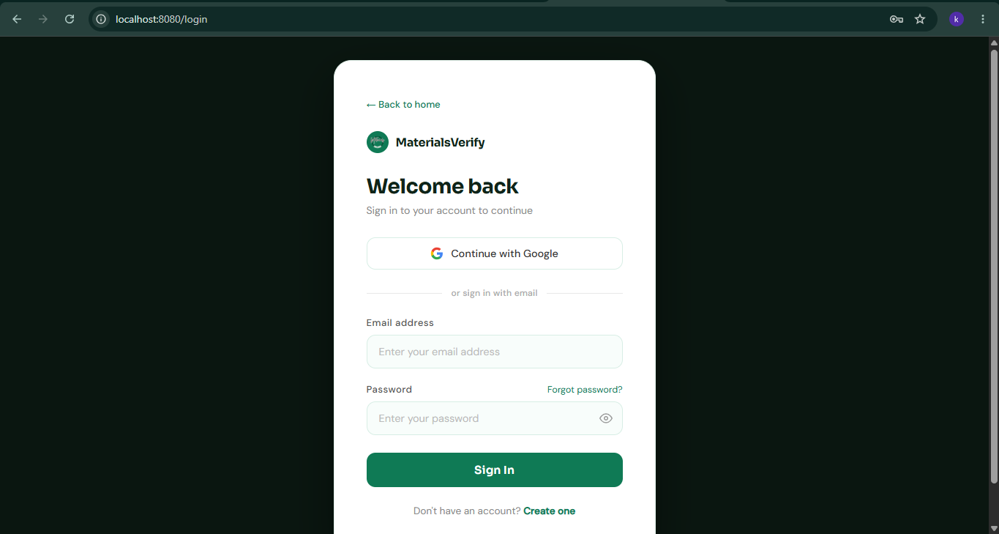
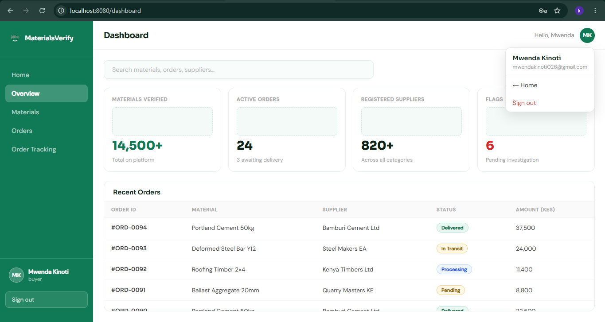

# Week 7: Authentication & Session Management

## Pre-requisite
[BIT3208-Week7-Authentication](https://github.com/martin-m-kinoti/BIT3208-Week7-Authentication)

---

## Features

**Registration System** 
Users can create an account by submitting their details through a registration form. Input is validated before being saved to the database.

**Secure Login** 
A login form authenticates users by verifying their credentials against stored records. Invalid attempts are rejected with appropriate error messages.

**Password Hashing** 
Passwords are hashed using bcrypt before being stored, ensuring plain-text passwords are never saved to the database. Comparison is done securely at login time.

**Session Management** 
Upon successful login, a server-side session is created to track the authenticated user across requests. Sessions persist until the user logs out or the session expires.

**Protected Dashboard** 
The dashboard route is guarded by middleware that checks for an active session. Unauthenticated users are redirected to the login page.

**Logout Functionality** 
Logging out destroys the server-side session and clears the session cookie. The user is then redirected back to the login page.

## Screenshots

### Registration System

### Secure Login

### Logout Functionality

