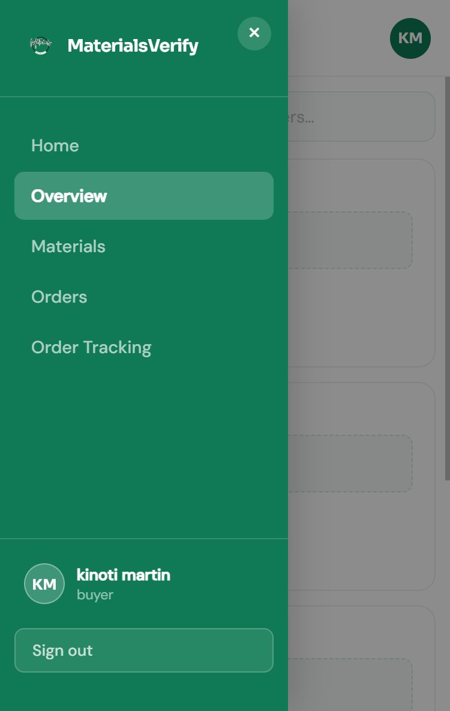
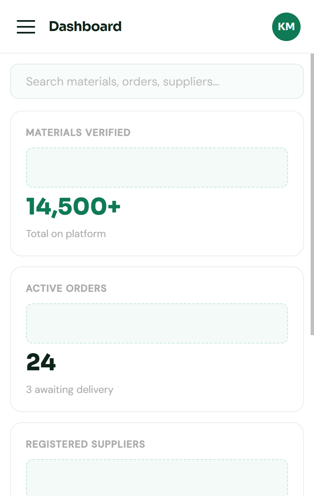
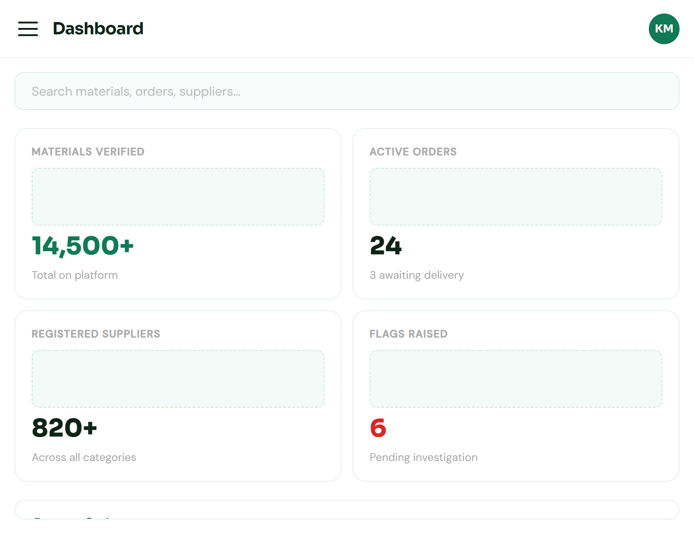
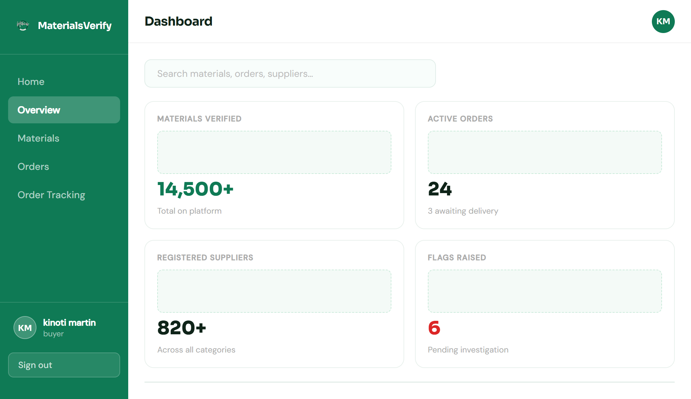

# Week 8: Responsive Web Design & Mobile-First Development

## Pre-requisite
[BIT3208-Week8-Responsive-Design](https://github.com/martin-m-kinoti/BIT3208-Week8-Responsive-Design)

---

## Overview

This week focuses on making the entire application fully responsive across all screen sizes; mobile phones, tablets, and desktops. A mobile-first approach was applied using CSS media queries, Flexbox, and CSS Grid to adapt layouts, navigation, and content presentation at each breakpoint.

---

## Breakpoints

| Breakpoint | Target |
|---|---|
| `> 1024px` | Desktop: full sidebar, 4-column grid |
| `≤ 1024px` | Tablet: narrower sidebar, 2-column grid |
| `≤ 768px` | Phablet: slide-in drawer, mobile cards |
| `≤ 480px` | Mobile: single column, compact spacing |

---

## Features Implemented

### 1. Responsive Sidebar Navigation
The sidebar switches from a fixed panel on desktop to a hidden slide-in drawer on mobile, toggled by a hamburger button. A dark overlay closes the drawer when tapped, and a close `×` button appears inside the sidebar on small screens only.

---

### 2. Mobile Content Layout
Dashboard stat cards reflow from a 4-column grid on desktop down to a 2-column then single-column layout. The orders data table is hidden on mobile and replaced with a dedicated card list that is easier to read on small screens.

---

### 3. Tablet View
At tablet widths the sidebar narrows, the topbar greeting is hidden to save space, and content grids shift to 2-column layouts. The hero section on the landing page stacks vertically with centered text and inline stat cards.

---

### 4. Desktop View
The full layout is shown with the persistent 210px sidebar, a 4-column stat card row, a complete orders table, and the multi-column landing page hero with side-by-side stat cards.

